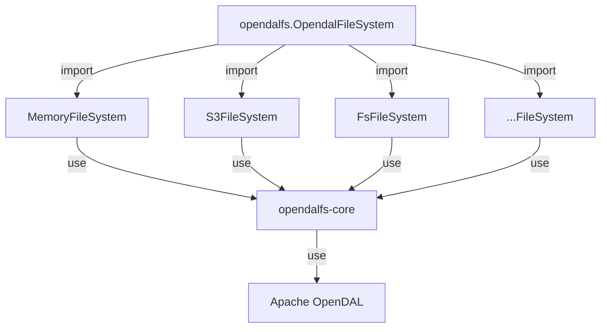
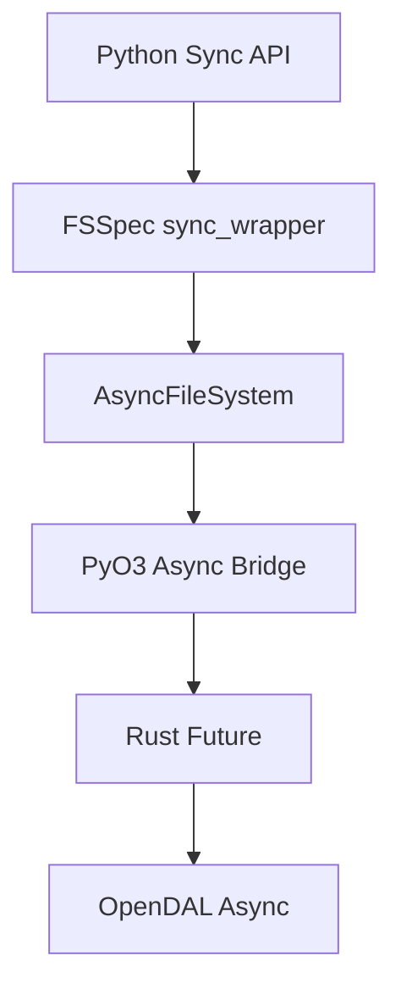

# Contributing

opendalfs is a hybrid of Rust and Python. The underlying implementation is written in Rust, with a Python interface provided by PyO3.

## Project Structure



- `opendalfs` is the python interface implementing the `fsspec` API
- `crates/core` is the Rust core implementation
- `crates/service-*` provides service configurations and Python packages

## Development Setup

1. Clone the repository:
```shell
git clone https://github.com/fsspec/opendalfs.git
cd opendalfs
```

2. Create a virtual environment and install dependencies:
```shell
python -m venv .venv
source .venv/bin/activate
pip install -e ".[all]"  # Install all dependencies
```

### Dependency Groups

The project uses several dependency groups:
- `memory`: Memory backend service
- `s3`: S3 backend service
- `dev`: Development tools (ruff, maturin, build, twine)
- `test`: Testing tools (pytest, pytest-asyncio, pytest-cov, fsspec, s3fs)
- `all`: All dependencies combined

Install specific groups as needed:
```shell
pip install -e ".[dev,test]"  # For development and testing
pip install -e ".[s3]"        # For S3 backend development
```

## Testing

### Prerequisites

1. For S3 tests, you need MinIO running locally:
```shell
docker compose -f tests/docker/docker-compose.yml up -d
```

Note: The S3 tests use these default settings:
- Endpoint: http://localhost:9000
- Region: us-east-1
- Access Key: minioadmin
- Secret Key: minioadmin
- Bucket: test-bucket

### Running Tests

1. Run the test suite:
```shell
pytest -v
```

2. After testing, stop MinIO:
```shell
docker compose -f tests/docker/docker-compose.yml down
```

## Code Style

### Rust
- Format: `cargo fmt`
- Lint: `cargo clippy --all-targets --workspace`

### Python
- Format and lint: `ruff format .`
- Check: `ruff check .`

## Building

We use [maturin](https://pyo3.rs/) to build Rust extensions for Python:

```shell
# Build service packages
maturin develop -m crates/service-memory/Cargo.toml
maturin develop -m crates/service-s3/Cargo.toml
```

## CI/CD

Our GitHub Actions workflows handle:
- Code formatting and linting
- Building packages
- Running tests with MinIO
- Package distribution checks

See `.github/workflows/` for detailed configurations.

## Async/Sync Architecture

### PyO3 Async Integration

We use `pyo3-asyncio` to bridge between Rust futures and Python coroutines:



1. **Rust Side (`fs.rs`)**:
   - Uses `future_into_py` to convert Rust futures to Python awaitables
   - Example:
   ```rust
   fn _write<'py>(&self, py: Python<'py>, path: &str, data: Vec<u8>) -> PyResult<&PyAny> {
       let op = self.op.clone();
       future_into_py(py, async move {
           op.write(path, data).await.map_err(|e| PyException::new_err(e.to_string()))
       })
   }
   ```

2. **Python Side (`fs.py`)**:
   - Implements both async and sync interfaces
   - Uses `fsspec.asyn.AsyncFileSystem` as base class
   - Example:
   ```python
   async def _write(self, path: str, data: bytes) -> None:
       future = self.fs._write(path, data)
       await self._call_rust(future)

   def write(self, path: str, data: bytes) -> None:
       return sync(self.loop, self._write, path, data)
   ```

### FSSpec Integration

We follow FSSpec's async/sync patterns:

1. **Async Methods**:
   - Prefixed with `_` (e.g., `_write`, `_read`)
   - Handle the actual async operations
   - Called by sync wrappers or directly in async contexts

2. **Sync Wrappers**:
   - Use `fsspec.asyn.sync_wrapper` for simple methods
   - Use `fsspec.asyn.sync` for complex operations
   - Handle event loop management automatically

3. **Event Loop Management**:
   - FSSpec creates and manages the event loop
   - Operations run in a dedicated IO thread
   - Similar to s3fs implementation for consistency

### Implementation Pattern

When adding new functionality:

1. **Rust Side**:
   ```rust
   fn method_name<'py>(&self, py: Python<'py>, ...) -> PyResult<&PyAny> {
       future_into_py(py, async move {
           // Async operation
       })
   }
   ```

2. **Python Side**:
   ```python
   async def _method_name(self, ...):
       """Async implementation"""
       future = self.fs.method_name(...)
       return await self._call_rust(future)

   def method_name(self, ...):
       """Sync wrapper"""
       return sync(self.loop, self._method_name, ...)
   ```

This architecture ensures:
- Proper async/sync conversion between Rust and Python
- Compatibility with FSSpec's patterns
- Consistent behavior across storage backends
- Efficient IO handling through dedicated event loops
