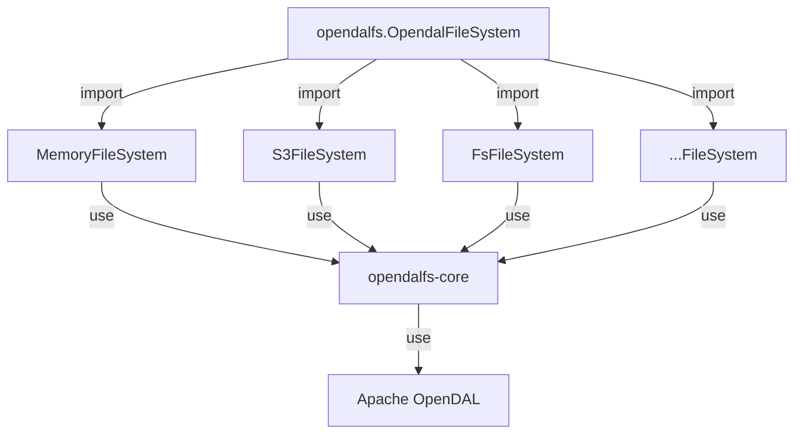
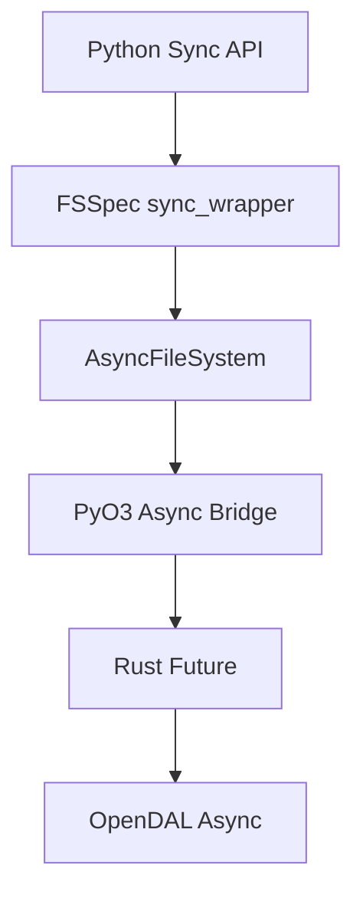

# Contributing

opendalfs is a hybrid of Rust and Python. The underlying implementation is written in Rust, with a Python interface provided by python.

The overall structure of the project is as follows:



- `opendalfs` is the python interface which will implement `fsspec` API and interact with services.
- `crates/core` is the Rust core implementation.
- `crates/service-*` provides the service configurations and python packages that used by `opendalfs`.

## Async/Sync Architecture

### PyO3 Async Integration

We use `pyo3-asyncio` to bridge between Rust futures and Python coroutines:



1. **Rust Side (`fs.rs`)**:
   - Uses `future_into_py` to convert Rust futures to Python awaitables
   - Example:
   ```rust
   fn _write<'py>(&self, py: Python<'py>, path: &str, data: Vec<u8>) -> PyResult<&PyAny> {
       let op = self.op.clone();
       future_into_py(py, async move {
           op.write(path, data).await.map_err(|e| PyException::new_err(e.to_string()))
       })
   }
   ```

2. **Python Side (`fs.py`)**:
   - Implements both async and sync interfaces
   - Uses `fsspec.asyn.AsyncFileSystem` as base class
   - Example:
   ```python
   async def _write(self, path: str, data: bytes) -> None:
       future = self.fs._write(path, data)
       await self._call_rust(future)

   def write(self, path: str, data: bytes) -> None:
       return sync(self.loop, self._write, path, data)
   ```

### FSSpec Integration

We follow FSSpec's async/sync patterns:

1. **Async Methods**:
   - Prefixed with `_` (e.g., `_write`, `_read`)
   - Handle the actual async operations
   - Called by sync wrappers or directly in async contexts

2. **Sync Wrappers**:
   - Use `fsspec.asyn.sync_wrapper` for simple methods
   - Use `fsspec.asyn.sync` for complex operations
   - Handle event loop management automatically

3. **Event Loop Management**:
   - FSSpec creates and manages the event loop
   - Operations run in a dedicated IO thread
   - Similar to s3fs implementation for consistency

### Implementation Pattern

When adding new functionality:

1. **Rust Side**:
   ```rust
   fn method_name<'py>(&self, py: Python<'py>, ...) -> PyResult<&PyAny> {
       future_into_py(py, async move {
           // Async operation
       })
   }
   ```

2. **Python Side**:
   ```python
   async def _method_name(self, ...):
       """Async implementation"""
       future = self.fs.method_name(...)
       return await self._call_rust(future)

   def method_name(self, ...):
       """Sync wrapper"""
       return sync(self.loop, self._method_name, ...)
   ```

This architecture ensures:
- Proper async/sync conversion between Rust and Python
- Compatibility with FSSpec's patterns
- Consistent behavior across storage backends
- Efficient IO handling through dedicated event loops

## Rust

The whole project is a rust workspace, most operations can handled by `cargo`.

- format: `cargo fmt`
- check: `cargo clippy --all-targets --workspace`

## Python

Use `ruff` to check and format python code:

- format: `ruff format .`
- check: `ruff check .`

## Testing

Tests are organized into two main categories:

### Core Tests
Located in `tests/core/`, these test the fundamental functionality that should work across all backends:
- `test_basic.py`: Basic filesystem operations (create, exists)
- `test_io.py`: IO operations (read, write)
- `test_metadata.py`: Metadata operations (info, timestamps)
- `test_directory.py`: Directory operations (mkdir, ls, rm)

### Backend Tests
Located in `tests/backends/`, these test backend-specific behaviors:
- `test_memory.py`: Memory backend specific features
- `test_s3.py`: S3 backend specific features

### Adding New Tests
When adding new functionality:
1. Add core functionality tests to appropriate file in `tests/core/`
2. If the feature has backend-specific behavior, add tests to `tests/backends/`
3. Use the existing fixtures `memory_fs` and `s3_fs` from `conftest.py`
4. Follow the pattern of testing both backends in core tests where applicable

### Prerequisites

1. For S3 tests, you need MinIO running locally. Start it using:
```shell
docker compose -f tests/docker/docker-compose.yml up -d
```

+ Note: The S3 tests use the following default configuration:
+ - Endpoint: http://localhost:9000
+ - Region: us-east-1
+ - Access Key: minioadmin
+ - Secret Key: minioadmin
+ - Bucket: test-bucket

### Running Tests

1. Run the test suite:
```shell
pytest -v
```

2. After testing, you can stop MinIO:
```shell
docker compose -f tests/docker/docker-compose.yml down
```

### CI Testing

Our GitHub Actions workflow automatically sets up MinIO for testing in CI. The workflow:
1. Starts a MinIO container
2. Builds and installs the packages
3. Runs the test suite

You can check `.github/workflows/test.yml` for the detailed CI configuration.

## PyO3

We are using [pyo3](https://pyo3.rs/) to call rust from python. Please install `maturin` to build the python package.

```shell
python -m venv venv
source venv/bin/activate
pip install maturin
```

Build service packages:

```shell
maturin develop -m crates/service-s3/Cargo.toml
maturin develop -m crates/service-memory/Cargo.toml
```
