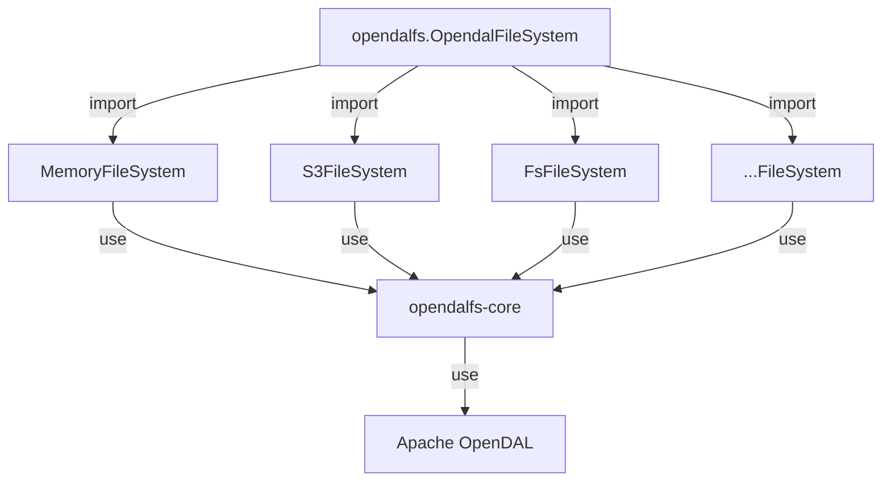

# Contributing

opendalfs is a hybrid of Rust and Python. The underlying implementation is written in Rust, with a Python interface provided by python.

The overall structure of the project is as follows:



- `opendalfs` is the python interface which will implement `fsspec` API and interact with services.
- `crates/core` is the Rust core implementation.
- `crates/service-*` provides the service configurations and python packages that used by `opendalfs`.

## Rust

The whole project is a rust workspace, most operations can handled by `cargo`.

- format: `cargo fmt`
- check: `cargo clippy --all-targets --workspace`

## Python

Use `ruff` to check and format python code:

- format: `ruff format .`
- check: `ruff check .`

Use `pytest` to execute tests:

```shell
pytest
```

## PyO3

We are using [pyo3](https://pyo3.rs/) to call rust from python. Please install `maturin` to build the python package.

```shell
python -m venv venv
source venv/bin/activate
pip install maturin
```

Build service packages:

```shell
maturin develop -m crates/service-s3/Cargo.toml
```
